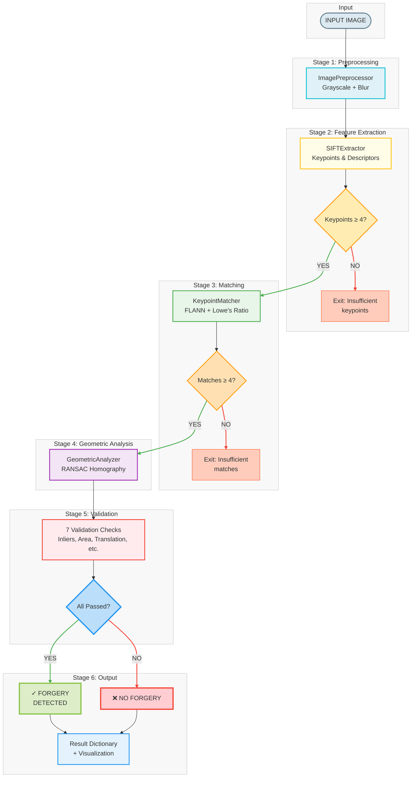

```mermaid
graph TB
    subgraph Input
        A([INPUT IMAGE])
    end
    
    subgraph Stage1["Stage 1: Preprocessing"]
        B["ImagePreprocessor<br/>Grayscale + Blur"]
    end
    
    subgraph Stage2["Stage 2: Feature Extraction"]
        C["SIFTExtractor<br/>Keypoints & Descriptors"]
        C1{Keypoints ≥ 4?}
        E1[Exit: Insufficient<br/>keypoints]
    end
    
    subgraph Stage3["Stage 3: Matching"]
        D["KeypointMatcher<br/>FLANN + Lowe's Ratio"]
        D1{Matches ≥ 4?}
        E2[Exit: Insufficient<br/>matches]
    end
    
    subgraph Stage4["Stage 4: Geometric Analysis"]
        F["GeometricAnalyzer<br/>RANSAC Homography"]
    end
    
    subgraph Stage5["Stage 5: Validation"]
        G["7 Validation Checks<br/>Inliers, Area, Translation, etc."]
        H{All Passed?}
    end
    
    subgraph Output["Stage 6: Output"]
        I[✓ FORGERY<br/>DETECTED]
        J[❌ NO FORGERY]
        K["Result Dictionary<br/>+ Visualization"]
    end
    
    A --> B
    B --> C
    C --> C1
    C1 -->|NO| E1
    C1 -->|YES| D
    D --> D1
    D1 -->|NO| E2
    D1 -->|YES| F
    F --> G
    G --> H
    H -->|YES| I
    H -->|NO| J
    I --> K
    J --> K
    
    style Input fill:#F8F8F8,stroke:#CCC,stroke-width:1px
    style Stage1 fill:#F8F8F8,stroke:#CCC,stroke-width:1px
    style Stage2 fill:#F8F8F8,stroke:#CCC,stroke-width:1px
    style Stage3 fill:#F8F8F8,stroke:#CCC,stroke-width:1px
    style Stage4 fill:#F8F8F8,stroke:#CCC,stroke-width:1px
    style Stage5 fill:#F8F8F8,stroke:#CCC,stroke-width:1px
    style Output fill:#F8F8F8,stroke:#CCC,stroke-width:1px

    style A fill:#DCE9F0,stroke:#607D8B,stroke-width:2px 
    style B fill:#E0F2F7,stroke:#00BCD4,stroke-width:2px 
    style C fill:#FFFDE7,stroke:#FFC107,stroke-width:2px 
    style D fill:#E8F5E9,stroke:#4CAF50,stroke-width:2px 
    style F fill:#F3E5F5,stroke:#9C27B0,stroke-width:2px 
    style G fill:#FFEBEE,stroke:#F44336,stroke-width:2px 
    style I fill:#DCEDC8,stroke:#8BC34A,stroke-width:3px 
    style J fill:#FFCDD2,stroke:#F44336,stroke-width:3px 
    style K fill:#E3F2FD,stroke:#2196F3,stroke-width:2px 
    style C1 fill:#FFECB3,stroke:#FF9800,stroke-width:2px 
    style D1 fill:#FFE0B2,stroke:#FF9800,stroke-width:2px 
    style H fill:#BBDEFB,stroke:#2196F3,stroke-width:3px 
    style E1 fill:#FFCCBC,stroke:#FF5722
    style E2 fill:#FFCCBC,stroke:#FF5722
    
    linkStyle 3 stroke:#F44336,stroke-width:2px
    linkStyle 4 stroke:#4CAF50,stroke-width:2px
    linkStyle 6 stroke:#F44336,stroke-width:2px
    linkStyle 7 stroke:#4CAF50,stroke-width:2px
    linkStyle 10 stroke:#4CAF50,stroke-width:2px
    linkStyle 11 stroke:#F44336,stroke-width:2px
```